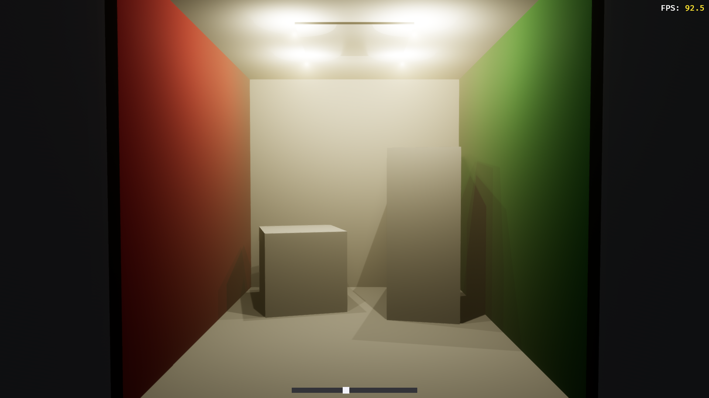

# Cornell Box + Volumetric Fog

A Bevy demo showcasing:
- A Cornell-style box scene
- Volumetric fog (`FogVolume`, `VolumetricLight`, `VolumetricFog`)
- Multiple point lights with shadows & volumetric shafts
- Bloom + HDR tonemapping
- FPS counter
- Interactive slider (adjusts light intensity in real time)

---

## 📸 Screenshot



## 🚀 Run

Clone and run directly:

```bash
git clone https://github.com/kwstasg/rust_cornell_box.git
cd rust_cornell_box
cargo run --release
```

## 🛠️ Requirements
- Rust (latest stable) — install via https://rustup.rs/
- Bevy 0.16 — already specified in Cargo.toml
- GPU — Drivers with modern API support

The app starts borderless fullscreen on the primary monitor.

## 🎮 Usage
Drag the slider at the bottom of the screen to change ceiling light brightness.
FPS counter is shown in the top-right corner.